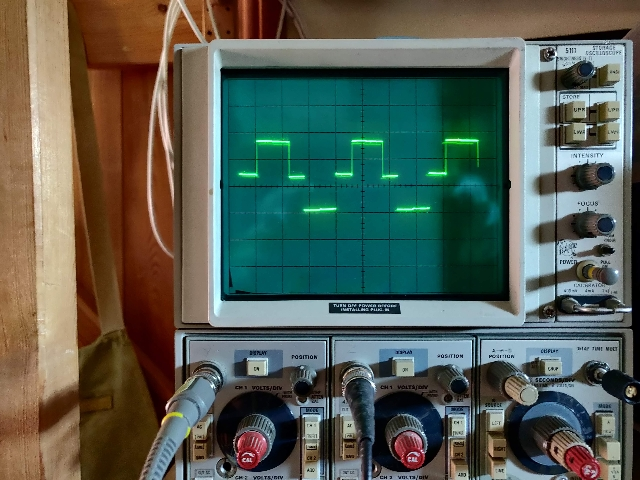

# ESC_Inverter_400Hz
Repurpose a BLDC ESC as 3 phase 400Hz inverter driver.

A new firmare is programmed into the atmega 8 microcontroller to drive three phases into a 400Hz transformer. The transformer used is made as a 115 to 14 VAC but used here in reverse to generate a 115 VAC 400 Hz supply from a 20 VDC input, suitable for driving avaiation instruments. Tested on a Sperry articicial horizon gyroscope.

[test load hardare](./images/IMG_20220419_092617.jpg)

[test load waveforms](./images/IMG_20220419_092551.jpg)

[three phase transformer](./images/IMG_20220419_124352.jpg)

## prototype firmware

The firmware is a hacked version of a DIY BLDC motor driver with the back EMF feedback sensing removed and operating at fixed frequency of approx 403Hz. Adapted form arduino Uno 348 to atmega 8. programming is done with avrdude connected by adding programming connections to CPU, no bootloaded or serial connection is needed.

The firmware options are set to:

  * Board: ATmega 8
  * Clock: Internal 8 MHz
  * Bootloader: No bootloader

[arduino sketch](./ESC_400Hz_Gen/ESC_400Hz_Gen.ino)

The firmware also oututs a 5 volt 400 Hz square wave sync signal on the unused speed control input (three way connector - white wire)

## ESC hardware notes

Commutation was checked using the test resistor netword shown in the notes, one pair of resistors for each phase output. 

The transformer was supplied pre-wired in star formation, this has been retained.
The three phase outputs of the ESC wired to each of the transformer phase terminals. The common neutral is left unconnected. For 115 p-p output about 20 VDC input is needed.

During gyro motor starting and spinup about 3 amps are drawn from the DC power supply, afterwards this drops to about 1 amp.

It may be possible to operate this circuit at 12 volts DC input is the transformer is re connected into delta formation - todo.

### [Programming ATmega8 Using Arduino IDE](https://create.arduino.cc/projecthub/hami/programming-atmega8-using-arduino-ide-90c2ad)

### [Sensorless BLDC motor control with Arduino – DIY ESC](https://simple-circuit.com/arduino-sensorless-bldc-motor-controller-esc/)

### [AVRDUDESS – A GUI for AVRDUDE](https://blog.zakkemble.net/avrdudess-a-gui-for-avrdude/)

